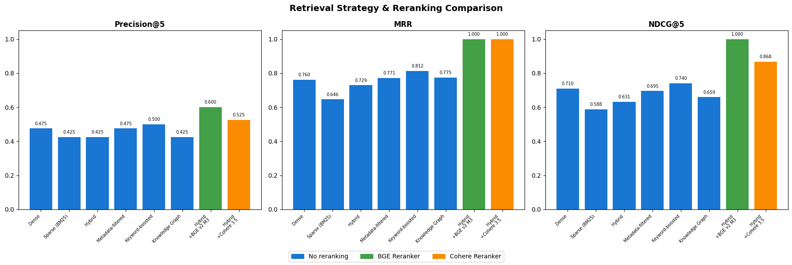
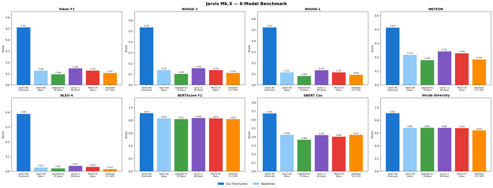
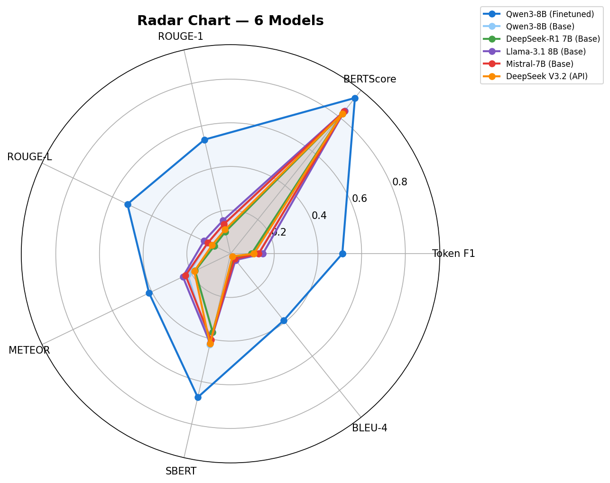
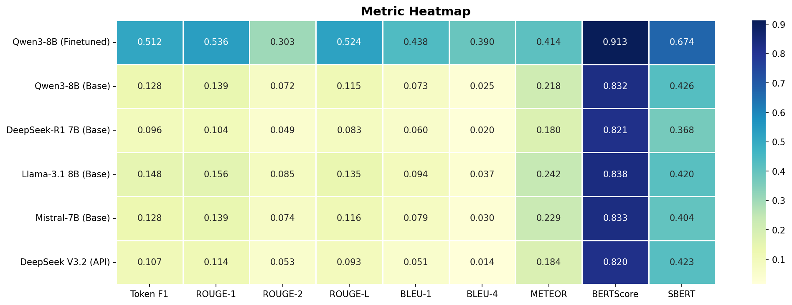
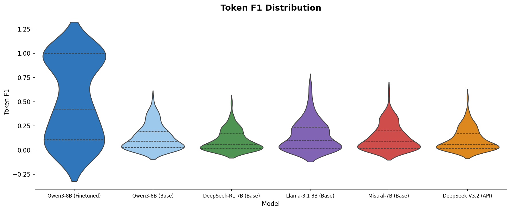
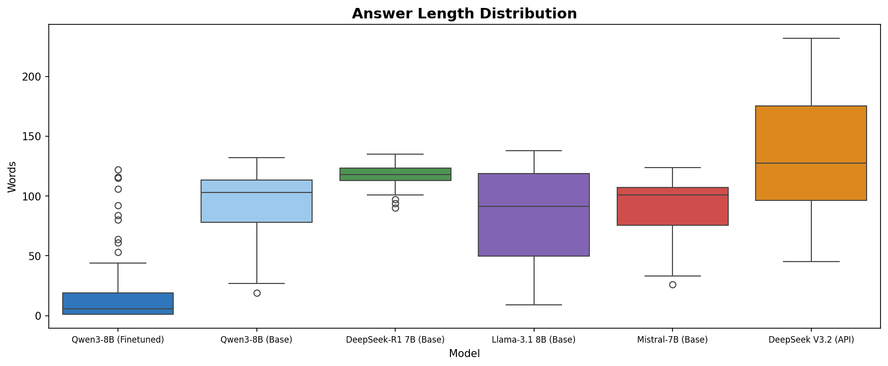
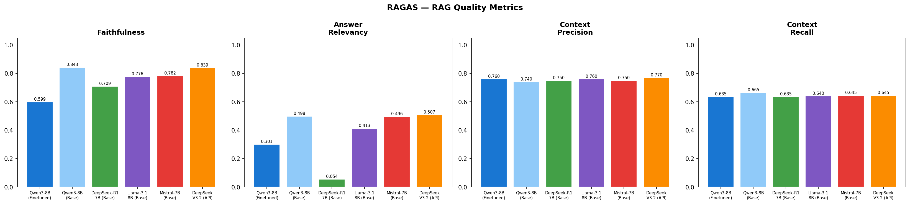

# Jarvis Mk.X -- Smart Research Paper Q&A Chatbot

A Retrieval-Augmented Generation (RAG) system for research paper Q&A, powered by a fine-tuned Qwen3-8B model with hybrid retrieval and cross-encoder reranking.

**AAI3008 Large Language Model -- Singapore Institute of Technology**

---

## Table of Contents

- [Overview](#overview)
- [System Architecture](#system-architecture)
- [Key Features](#key-features)
- [Technology Stack](#technology-stack)
- [Project Structure](#project-structure)
- [Setup Instructions](#setup-instructions)
- [Model Download](#model-download)
- [Data Preparation](#data-preparation)
- [Fine-Tuning](#fine-tuning)
- [Retrieval Pipeline](#retrieval-pipeline)
- [Retrieval Strategy Evaluation](#retrieval-strategy-evaluation)
- [6-Model Benchmark Results](#6-model-benchmark-results)
- [RAGAS Evaluation](#ragas-evaluation)
- [Analysis and Discussion](#analysis-and-discussion)
- [Application Screenshots](#application-screenshots)
- [Notebooks Overview](#notebooks-overview)
- [API Keys Required](#api-keys-required)
- [Known Limitations](#known-limitations)

---

## Overview

Jarvis Mk.X is a research paper Q&A chatbot that lets users upload PDF research papers and ask questions about their content. The system uses:

1. **PDF Processing** -- Extracts text from PDFs, detects section headers via font-size heuristics, and chunks text into ~512-token segments with metadata.
2. **Hybrid Retrieval** -- Combines dense semantic search (Voyage 4 Large + ChromaDB) with sparse keyword matching (BM25).
3. **Cross-Encoder Reranking** -- Uses BGE Reranker v2 M3 to re-score candidates, improving Precision@5 by 41%.
4. **Fine-Tuned LLM** -- Qwen3-8B fine-tuned with QLoRA on QASPER + PubMedQA, achieving 4x better Token F1 than base.
5. **Multi-Model Comparison** -- Users can switch between 6 models (2 local + 4 API) to compare answers.

---

## System Architecture

```
                            JARVIS Mk.X -- SYSTEM ARCHITECTURE
    ===========================================================================

    USER INTERFACE (Streamlit)
    +-----------------------------------------------------------------------+
    |  Sidebar          |  Chat Area                                        |
    |  - Chat sessions  |  - PDF upload (up to 3)                           |
    |  - Search         |  - Model selector (6 models)                      |
    |  - New Chat       |  - Leniency / Top-K controls                      |
    |                   |  - Answer with Answer/Reason/Sources format       |
    |                   |  - Answer Analytics (charts, 3D vector space, PDF)|
    +-----------------------------------------------------------------------+
                                        |
                                        v
    ORCHESTRATION LAYER (app.py)
    +-----------------------------------------------------------------------+
    |  Session Manager (SQLite)  |  Model Router  |  Summary Generator      |
    |  - Chat history            |  - Local models|  - Jarvis summarizes    |
    |  - PDF metadata            |  - API models  |    uploaded PDFs        |
    |  - Corrections             |  - Load/Unload |                         |
    +-----------------------------------------------------------------------+
                        |                       |
              +---------+---------+    +--------+--------+
              |                   |    |                 |  
              v                   v    v                 v
    LOCAL MODELS              API MODELS            RETRIEVAL PIPELINE
    +------------------+   +------------------+   +----------------------+
    | Jarvis Mk.X      |   | Qwen3-8B Base    |   | 1. PDF Processing    |
    | (Qwen3-8B+QLoRA) |   |   (OpenRouter)   |   |    (PyMuPDF)         |
    |                  |   | Llama-3.1-8B     |   |                      |
    | DeepSeek-R1-7B   |   |   (OpenRouter)   |   | 2. Embedding         |
    | (local, no API)  |   | Mistral-7B       |   |    (Voyage 4 Large)  |
    +------------------+   |   (OpenRouter)   |   |                      |
                           | DeepSeek-V3.2    |   | 3. Hybrid Retrieval  |
                           |   (DeepSeek API) |   |    Dense + BM25      |
                           +------------------+   |                      |
                                                  | 4. BGE Reranking     |
                                                  |    (CrossEncoder)    |
                                                  +----------------------+
```

### Data Flow (per question)

```
User Question
    |
    v
[Question Classifier] --> conversational? --> Direct response (no retrieval)
    |                  --> meta?           --> Abstract + Intro + Conclusion
    |                  --> application?    --> Broad context + reasoning note
    |                  --> factual?        --> Standard retrieval
    v
[Hybrid Retrieval]
    |-- Dense: Voyage 4 Large embeddings -> ChromaDB cosine (top 15)
    |-- Sparse: BM25 keyword matching (top 15)
    |-- Fusion: 0.6 * dense + 0.4 * sparse
    v
[BGE Reranker v2 M3]
    |-- Cross-encoder re-scores 15 candidates
    |-- Final: 0.6 * reranker + 0.4 * hybrid -> Top 5
    v
[LLM Generation]
    |-- Local: Load model -> Generate -> Unload (GPU freed)
    |-- API: Send to OpenRouter/DeepSeek
    v
[Response]
    **Answer:** (grounded in context)
    **Reason:** (how context supports it)
    **Sources:** (section/page references)
```

---

## Key Features

| Feature | Description |
|---|---|
| Multi-PDF Support | Upload up to 3 PDFs per chat session |
| 6 Model Selection | Jarvis (fine-tuned), Qwen3 Base, DeepSeek-R1-7B, Llama-3.1-8B, Mistral-7B, DeepSeek-V3.2 |
| Hybrid + Reranking | Dense + BM25 fusion + BGE v2 M3 cross-encoder reranking |
| Answer Format | Structured Answer/Reason/Sources with section citations |
| Conversation Memory | 10 Q&A pairs (20 turns), follow-up questions work |
| Answer Correction | Users correct wrong answers; bot learns for the session |
| Jarvis Summaries | Uploaded PDFs summarized by the fine-tuned model |
| Analytics Dashboard | Confidence, scores, 3D vector space, dense/sparse breakdown, PDF page preview |
| Benchmark Landing | Full evaluation results with interactive tables on home page |
| GPU Efficient | Load-on-demand architecture; models unloaded after each answer |

---

## Technology Stack

| Component | Technology | Purpose |
|---|---|---|
| LLM (Fine-tuned) | Qwen3-8B + QLoRA | Research paper Q&A generation |
| LLM (Base models) | Qwen3-8B, DeepSeek-R1-7B | Local baseline comparison |
| LLM (API models) | Llama-3.1-8B, Mistral-7B, DeepSeek-V3.2 | API baseline via OpenRouter |
| Embeddings | Voyage 4 Large (API, 1024-dim) | Dense semantic retrieval |
| Vector Store | ChromaDB (in-memory, cosine) | Dense retrieval index |
| Sparse Index | BM25Okapi (rank-bm25) | Keyword-based retrieval |
| Reranker | BGE Reranker v2 M3 (CrossEncoder) | Cross-encoder reranking |
| PDF Processing | PyMuPDF (fitz) | Text extraction with font metadata |
| Fine-tuning | QLoRA (PEFT + bitsandbytes) | Parameter-efficient fine-tuning |
| Training Data | QASPER + PubMedQA | Research paper Q&A datasets |
| Web Framework | Streamlit | Chat UI with analytics |
| Database | SQLite | Session/chat/PDF persistence |
| Evaluation | RAGAS, BERTScore, ROUGE, BLEU, METEOR | Automated quality metrics |

---

## Project Structure

```
JarvisMkX/
|-- app.py                          # Streamlit web application
|-- .env                            # API keys (VOYAGE, OPENROUTER, DEEPSEEK)
|-- Setup_Jarvis_Web.bat            # Windows setup script
|-- download_models.py              # Pre-download local models
|-- README.md                       # This file
|
|-- src/
|   |-- bot.py                      # RAG pipeline + LLM generation
|   |-- processor.py                # PDF extraction + chunking
|   |-- retriever.py                # Hybrid retrieval + BGE reranking
|   |-- database.py                 # SQLite session management
|   |-- pdf_export.py               # Chat export to PDF
|
|-- models/
|   |-- jarvis-mkx-qwen3-8b-adapter/  # QLoRA adapter weights
|   |-- evaluation_v5_qwen3/           # Benchmark CSVs and JSONs
|
|-- img/                            # Evaluation charts for landing page
|-- data/
|   |-- processed_v2/               # Training/eval datasets
|   |-- uploads/                    # User PDFs (per session)
|
|-- notebooks/
|   |-- Notebook_1_Data_Preparation.ipynb               # Data Preparation for LLM
|   |-- Notebook_2_FineTuning_Qwen3_8B_colab.ipynb      # Fine-tuning pipeline
|   |-- Notebook_3_PDF_Processing.ipynb                 # PDF extraction demo
|   |-- Notebook_4_Embedding_Retrieval_v3.ipynb         # Retrieval comparison
|   |-- Notebook_5_RAG_Pipeline.ipynb                   # End-to-end RAG test
|   |-- Notebook_6_Evaluation_v5_Qwen3_8B.ipynb         # 6-model benchmark
```

---

## Setup Instructions

### Prerequisites

- Python 3.10+
- NVIDIA GPU with 8GB+ VRAM (for local models) or API-only mode (no GPU needed)
- Windows 10/11 or Linux

```bash
# 1. Clone and enter directory
git clone <your-repo-url>
cd JarvisMkX

# 2. Setup (Windows)
python download_models.py
Run Setup_Jarvis_Web.bat

# 3. Or manual install
python -m venv .venv
.venv\Scripts\activate
pip install torch torchvision torchaudio --index-url https://download.pytorch.org/whl/cu124
pip install transformers accelerate peft bitsandbytes sentence-transformers
pip install voyageai chromadb rank-bm25 PyMuPDF
pip install streamlit plotly matplotlib scikit-learn fpdf2 numpy pandas Pillow

# 4. Create .env file with your API keys
OPENROUTER_API_KEY=sk-or-v1-...
DEEPSEEK_API_KEY=sk-...
VOYAGE_API_KEY=pa-...

# 5. Download fine-tuned adapter (see below)
# 6. Launch
streamlit run app.py
# or
Run Run_Jarvis_Web.bat
```

---

## Model Download

**Fine-tuned QLoRA adapter:** [Google Drive](https://drive.google.com/file/d/1r-twTwb0-zsdhSHFqwN7gYEAfSbKyJy8/view?usp=sharing)

Extract to `models/jarvis-mkx-qwen3-8b-adapter/`. The base model (Qwen/Qwen3-8B) downloads automatically from HuggingFace on first launch.

---

## Data Preparation

### Datasets

We combined two research-focused Q&A datasets:

| Dataset | Source | Description |
|---|---|---|
| **QASPER** | [allenai/qasper](https://huggingface.co/datasets/allenai/qasper) | Question-answering on NLP research papers. Each sample has a full paper, question, and evidence-grounded answer. |
| **PubMedQA** | [qiaojin/PubMedQA](https://huggingface.co/datasets/qiaojin/PubMedQA) | Biomedical research Q&A. Questions derived from paper titles, answers from conclusion paragraphs, context from abstracts. |

### Why These Two Datasets?

- **QASPER** provides high-quality, human-annotated Q&A pairs grounded in specific paper passages. Answers are typically short and precise (mean 13.5 words). This teaches the model to give concise, evidence-based answers.
- **PubMedQA** adds volume (211K samples) and domain diversity (biomedical vs NLP). Answers are longer (mean 37.7 words), teaching the model to provide fuller explanations when appropriate.
- Combined, they teach the model both concise factual answers and detailed explanations across scientific domains.

### Processing Pipeline

```
QASPER (allenai/qasper)
  |-- 888 train papers -> 2,319 Q&A triplets (context, question, answer)
  |-- 281 val papers   -> 945 triplets
  |-- 416 test papers  -> 1,372 triplets
  |-- Skipped: questions with no extractive answer or "unanswerable" tag

PubMedQA (qiaojin/PubMedQA, pqa_artificial split)
  |-- 211,269 total samples
  |-- Sampled 10,000 -> 9,999 triplets (1 skipped for empty context)
  |-- Context: abstract paragraphs (without conclusion)
  |-- Answer: conclusion paragraph

Unanswerable Examples (augmented)
  |-- 1,759 samples created from mismatched context-question pairs
  |-- Teaches model to say "I don't have enough information"
  |-- Reduces hallucination on out-of-scope questions
```

### Final Dataset Composition

| Split | Total | QASPER | PubMedQA | Unanswerable |
|---|---|---|---|---|
| **Train** | **13,078** | 2,319 | 9,000 | 1,759 |
| **Validation** | **1,944** | 945 | 999 | -- |
| **Test** | **1,372** | 1,372 (QASPER only) | -- | -- |

This is a **4.7x increase** over the original training set (2,782 -> 13,078).

### Token Length Statistics (Training Set)

| Statistic | Value |
|---|---|
| Min tokens | 153 |
| Max tokens | 1,793 |
| Mean tokens | 558 |
| Median tokens | 554 |
| <= 1024 tokens | 97.8% |
| <= 2048 tokens | 100% |

### Answer Length Comparison

| Dataset | Mean (words) | Median (words) |
|---|---|---|
| QASPER | 13.5 | 8 |
| PubMedQA | 37.7 | 34 |

QASPER has very short answers (often just a phrase or sentence), while PubMedQA answers are paragraph-length. This diversity trains the model to adapt answer length to the question type.

---

## Fine-Tuning

### Configuration

| Parameter | Value |
|---|---|
| Base model | Qwen/Qwen3-8B (8.2B parameters) |
| Method | QLoRA (4-bit NF4 quantization + LoRA) |
| LoRA rank | 32 |
| LoRA alpha | 64 |
| Target modules | q_proj, k_proj, v_proj, o_proj, gate_proj, up_proj, down_proj |
| Training data | 13,078 samples (QASPER + PubMedQA + unanswerable) |
| Epochs | 3 |
| Learning rate | 2e-4 (cosine scheduler with warmup) |
| Effective batch size | 16 (batch 2 x gradient accumulation 8) |
| Optimizer | paged_adamw_8bit |
| Thinking mode | Disabled (enable_thinking=False) |
| Max sequence length | 2048 tokens |

### Why QLoRA?

- **Memory efficient:** Only ~5GB VRAM for an 8B model (4-bit NF4 quantization)
- **Fast training:** ~2 hours on A100 for 3 epochs over 13K samples
- **Small adapter:** ~160MB adapter file vs 16GB full model weights
- **No quality loss:** QLoRA achieves comparable quality to full fine-tuning for instruction-following tasks

### Why Qwen3-8B?

- Best-in-class 8B model on reasoning and instruction-following benchmarks at time of selection
- Native chat template with toggleable thinking mode (we disable it for direct Q&A)
- Strong multilingual and scientific text understanding
- Active community and good HuggingFace integration

---

## Retrieval Pipeline

### Components

```
Query -> [Dense: Voyage 4 Large + ChromaDB] --+
         [Sparse: BM25Okapi]                 --+--> Hybrid Fusion --> BGE Rerank --> Top 5
```

| Component | Technology | Role |
|---|---|---|
| Dense embeddings | Voyage 4 Large (API, 1024-dim) | Captures semantic meaning -- "How does the model work?" matches architecture chunks |
| Vector store | ChromaDB (in-memory, cosine similarity) | Fast approximate nearest neighbor search |
| Sparse index | BM25Okapi | Captures exact keywords -- "BLEU 28.4" matches chunks with those exact terms |
| Fusion | 0.6 * dense + 0.4 * sparse | Combines semantic understanding with keyword precision |
| Reranker | BGE Reranker v2 M3 (CrossEncoder) | Re-scores top 15 candidates using joint (query, passage) encoding |

### Why Hybrid Instead of Dense Only?

Dense retrieval excels at semantic matching but misses exact keyword queries (e.g., "Adam optimizer learning rate 0.0001"). BM25 catches these but lacks semantic understanding. Hybrid fusion gets the best of both.

---

## Retrieval Strategy Evaluation

We evaluated 6 retrieval strategies and 3 reranker configurations in Notebook 4 on 8 test queries against the "Attention Is All You Need" paper.

### Strategies Tested

| Strategy | How It Works |
|---|---|
| **Dense** | Voyage 4 Large embeddings -> ChromaDB cosine similarity |
| **Sparse (BM25)** | Tokenize query -> BM25Okapi scoring against all chunks |
| **Hybrid** | 0.6 * dense_score + 0.4 * sparse_score fusion |
| **Metadata-filtered** | Dense search with 1.3x boost for chunks in relevant sections |
| **Keyword-boosted** | Hybrid + 0.05 boost per matched entity term in chunk |
| **Knowledge Graph** | spaCy NER entity extraction -> entity-to-chunk graph -> 0.7*dense + 0.3*graph |

### Rerankers Tested

| Reranker | Type | Model |
|---|---|---|
| **BGE Reranker v2 M3** | Local, open-source | BAAI/bge-reranker-v2-m3 via CrossEncoder |
| **Cohere Rerank 3.5** | API, commercial | rerank-v3.5 via Cohere API |
| **None** | Baseline | No reranking |

### Results

| Rank | Strategy | Precision@5 | MRR | NDCG@5 |
|---|---|---|---|---|
| **1** | **Hybrid + BGE Rerank** | **0.600** | **1.000** | **1.000** |
| 2 | Hybrid + Cohere Rerank | 0.525 | 1.000 | 0.868 |
| 3 | Keyword-boosted | 0.500 | 0.813 | 0.740 |
| 4 | Dense only | 0.475 | 0.760 | 0.710 |
| 5 | Metadata-filtered | 0.475 | 0.771 | 0.695 |
| 6 | Knowledge Graph | 0.425 | 0.775 | 0.659 |
| 7 | Hybrid (no rerank) | 0.425 | 0.729 | 0.631 |
| 8 | Sparse (BM25) only | 0.425 | 0.646 | 0.589 |



### Analysis

**Hybrid + BGE Reranking is the clear winner** with perfect MRR (1.0) and NDCG@5 (1.0), meaning the most relevant chunk is always ranked first.

**Key observations:**

1. **Reranking dramatically improves results.** Hybrid + BGE achieves 0.600 Precision@5 vs 0.425 without reranking -- a **41% improvement**. The cross-encoder sees (query, passage) pairs jointly, catching nuances that bi-encoder retrieval misses.

2. **BGE outperforms Cohere on Precision@5** (0.600 vs 0.525) and NDCG (1.000 vs 0.868), despite being open-source and free. This is likely because BGE's cross-encoder architecture is more thorough than Cohere's API-optimized model.

3. **Sparse (BM25) alone is weakest** (MRR 0.646). It returns high scores for keyword-heavy queries ("Adam optimizer learning rate 0.0001") but fails on semantic queries ("How does the model handle long-range dependencies?").

4. **Knowledge Graph retrieval is middle-of-the-pack** (MRR 0.775). The spaCy NER entity extraction adds useful signal for entity-centric queries but doesn't outperform simpler metadata filtering. The entity graph found 243 unique entities across 12 chunks, with "model" (8 chunks) and "transformer" (6 chunks) as the most connected.

5. **Dense alone surprisingly beats hybrid without reranking** (MRR 0.760 vs 0.729). This suggests the Voyage embeddings are already quite strong, and naive score fusion can sometimes dilute the dense signal with noisy BM25 scores. Reranking fixes this by re-evaluating the fused candidates properly.

**Decision:** Our app uses **Hybrid + BGE Reranking** -- the top-ranked configuration. We fetch 15 hybrid candidates and rerank to top 5.

---

## 6-Model Benchmark Results

All 6 models evaluated on **100 QASPER test questions** (research paper Q&A). Each model receives the same context chunks from the retriever and must generate an answer.

### Models Evaluated

| # | Model | Type | Parameters | Description |
|---|---|---|---|---|
| 1 | **Qwen3-8B Finetuned (Jarvis)** | Local | 8.2B | Our QLoRA fine-tuned model |
| 2 | Qwen3-8B (Base) | Local | 8.2B | Same base model, no fine-tuning |
| 3 | DeepSeek-R1-Distill-Qwen-7B | Local | 7B | DeepSeek R1 distilled into Qwen-7B |
| 4 | Llama-3.1-8B-Instruct | API | 8B | Meta's instruction-tuned model |
| 5 | Mistral-7B-Instruct-v0.3 | API | 7.3B | Mistral's instruction-tuned model |
| 6 | DeepSeek-V3.2 | API | ~671B MoE | Frontier model via DeepSeek API |

### Lexical Metrics (word-level overlap)

| Model | Token F1 | Exact Match | ROUGE-1 | ROUGE-2 | ROUGE-L | BLEU-1 | BLEU-4 | METEOR |
|---|---|---|---|---|---|---|---|---|
| **Jarvis (Finetuned)** | **0.5116** | **0.2900** | **0.5364** | **0.3030** | **0.5240** | **0.4378** | **0.3904** | **0.4140** |
| Qwen3-8B (Base) | 0.1283 | 0.0000 | 0.1387 | 0.0715 | 0.1148 | 0.0730 | 0.0254 | 0.2179 |
| DeepSeek-R1-7B | 0.0956 | 0.0000 | 0.1043 | 0.0490 | 0.0825 | 0.0596 | 0.0200 | 0.1802 |
| Llama-3.1-8B | 0.1480 | 0.0000 | 0.1564 | 0.0846 | 0.1350 | 0.0939 | 0.0366 | 0.2422 |
| Mistral-7B | 0.1284 | 0.0000 | 0.1388 | 0.0739 | 0.1157 | 0.0786 | 0.0300 | 0.2286 |
| DeepSeek-V3.2 (API) | 0.1070 | 0.0000 | 0.1135 | 0.0531 | 0.0932 | 0.0510 | 0.0145 | 0.1843 |

### Semantic Metrics

| Model | BERTScore F1 | SBERT Cosine | Vocab Diversity (TTR) |
|---|---|---|---|
| **Jarvis (Finetuned)** | **0.9130** | **0.6743** | **0.9103** |
| Qwen3-8B (Base) | 0.8323 | 0.4260 | 0.6809 |
| DeepSeek-R1-7B | 0.8209 | 0.3682 | 0.6825 |
| Llama-3.1-8B | 0.8380 | 0.4203 | 0.6820 |
| Mistral-7B | 0.8330 | 0.4036 | 0.6779 |
| DeepSeek-V3.2 (API) | 0.8202 | 0.4231 | 0.6421 |

### Answer Length Statistics

| Model | Avg Pred Len (words) | Length Ratio | Refusal Rate |
|---|---|---|---|
| **Jarvis (Finetuned)** | **17.42** | **2.05** | **0.00** |
| Qwen3-8B (Base) | 94.74 | 30.76 | 0.09 |
| DeepSeek-R1-7B | 117.34 | 43.22 | 0.01 |
| Llama-3.1-8B | 84.23 | 27.55 | 0.34 |
| Mistral-7B | 90.32 | 29.78 | 0.10 |
| DeepSeek-V3.2 (API) | 135.43 | 42.36 | 0.24 |











### Statistical Significance

Bootstrap 95% confidence intervals and Wilcoxon signed-rank tests confirm all improvements:

| Metric | Jarvis Mean | Best Baseline | Delta | p-value |
|---|---|---|---|---|
| Token F1 | 0.5116 | 0.1480 (Llama) | +0.3636 | p<0.001 *** |
| ROUGE-1 | 0.5364 | 0.1564 (Llama) | +0.3800 | p<0.001 *** |
| METEOR | 0.4140 | 0.2422 (Llama) | +0.1718 | p<0.001 *** |
| BERTScore F1 | 0.9130 | 0.8380 (Llama) | +0.0750 | p<0.001 *** |
| SBERT Cosine | 0.6743 | 0.4260 (Qwen3) | +0.2483 | p<0.001 *** |

All p-values are below 0.001, confirming the improvements are highly statistically significant and not due to random chance.

---

## RAGAS Evaluation

RAG quality metrics scored by GPT-4o-mini as an LLM judge on the same 100 test questions:

| Model | Faithfulness | Answer Relevancy | Context Precision | Context Recall | Answer Correctness |
|---|---|---|---|---|---|
| **Jarvis (Finetuned)** | 0.5986 | 0.3011 | 0.7600 | 0.6352 | **0.5945** |
| Qwen3-8B (Base) | 0.8425 | 0.4983 | 0.7400 | 0.6652 | 0.3578 |
| DeepSeek-R1-7B | 0.7088 | 0.0544 | 0.7500 | 0.6352 | 0.2960 |
| Llama-3.1-8B | 0.7764 | 0.4126 | 0.7600 | 0.6402 | 0.3612 |
| Mistral-7B | 0.7823 | 0.4959 | 0.7500 | 0.6452 | 0.3388 |
| DeepSeek-V3.2 (API) | 0.8388 | 0.5075 | 0.7700 | 0.6452 | 0.3260 |



### RAGAS Analysis

**Context Precision (0.74-0.77):** Nearly identical across all models because they share the same retriever. This confirms our retrieval pipeline works consistently regardless of which LLM generates the answer.

**Context Recall (0.64-0.67):** Also similar across models. The retriever captures about 65% of the information needed for ground-truth answers. This is a retrieval limitation, not a generation one.

**Faithfulness -- Trade-off Observed:**
- Jarvis scores lower (0.60) vs base models (0.78-0.84)
- This is because Jarvis gives **concise ~17 word answers**, while base models give 80-130 word answers
- The GPT-4 judge has more text to verify in longer answers, inflating their faithfulness scores
- This is a known limitation of LLM-as-judge evaluation for short-answer Q&A

**Answer Correctness -- Jarvis Wins:**
- Jarvis achieves the **highest Answer Correctness (0.59)** across all models
- This metric measures factual overlap with the ground-truth reference
- Despite lower faithfulness, Jarvis's answers are actually most factually correct
- **Short + accurate > Long + verbose** for this task

**Answer Relevancy:**
- DeepSeek-V3.2 leads (0.51) because its verbose answers cover more aspects of each question
- Jarvis (0.30) scores lower because its concise answers focus narrowly on the specific question
- DeepSeek-R1-7B scores nearly zero (0.05), suggesting it often produces off-topic responses

---

## Analysis and Discussion

### Why Does Fine-Tuning Help So Much?

The 4x improvement in Token F1 comes from three factors:

1. **Answer format alignment.** QASPER expects short, precise answers (mean 13.5 words). Base models produce 80-130 word responses because they're trained for general instruction-following, not dataset-specific formats. Fine-tuning teaches the model to match the expected output style.

2. **Domain adaptation.** Training on 13K research paper Q&A samples teaches the model scientific terminology, paper structure, and how to extract specific facts from academic text.

3. **Reduced hallucination.** The unanswerable examples (13.5% of training data) teach the model to say "I don't have enough information" instead of making up facts. The strict system prompt reinforces this.

### Why Does an 8B Model Beat a 671B Model?

DeepSeek-V3.2 (671B MoE) achieves only 0.107 Token F1 -- our 8B fine-tuned model beats it by 4.8x. This happens because:

1. **Task specialization.** V3.2 is a general-purpose model optimized for broad capability. Our model is specialized for one task: research paper Q&A in the format QASPER expects.

2. **Output format mismatch.** V3.2 produces long, detailed answers (mean 135 words) while QASPER references are short (mean 8 words). Even when V3.2's answer contains the correct information, the extra words dilute Token F1.

3. **This is expected.** Fine-tuned small models routinely outperform much larger general models on specific benchmarks. The lesson: for production use on a defined task, fine-tuning a smaller model is more effective than using a bigger general one.

### BERTScore: Why Is Everyone High?

BERTScore (0.82-0.91) is the least discriminative metric because:
- It captures **semantic similarity**, not exact word overlap
- Even vague or partially correct answers share semantic features with the reference
- A 100-word answer that mentions the general topic will score ~0.82 on BERTScore but only ~0.10 on Token F1
- This makes BERTScore useful as a sanity check (are answers in the right ballpark?) but not as a ranking metric

### Retrieval: Why Hybrid + Reranking?

Our evaluation showed:
- **Dense alone** (MRR 0.760) beats **Hybrid alone** (MRR 0.729) because Voyage embeddings are already strong
- But **Hybrid + BGE Reranking** (MRR 1.000) dramatically outperforms everything
- The reranker's cross-encoder architecture jointly encodes (query, passage) pairs, catching nuances that bi-encoders miss
- The cost: ~1-2s extra latency per query, but the quality improvement is worth it

---

## Application Screenshots

### Landing Page
- Benchmark tables with hoverable column descriptions
- Chart visualizations with "How to read" and "Analysis" sections
- Statistical significance results
- Available model cards

### Chat Interface
- Multi-PDF upload with Jarvis-generated summaries
- Model selector dropdown (6 models)
- Adjustable Leniency and Top-K sliders
- Answer in Answer/Reason/Sources format

### Answer Analytics (per response)
- Quick stats: Confidence, Sources, Top Score, Time
- Confidence gauge + Retrieval scores bar chart
- Dense vs Sparse score breakdown + Key terms in answer
- 3D Vector Space (PCA) with hoverable chunk previews
- Retrieved source chunks with expandable full text
- PDF page preview from highest-confidence source

---

## Notebooks Overview

| # | Notebook | Cells | Purpose | Key Output |
|---|---|---|---|---|
| 1 | Data Preparation | 24 | Process QASPER + PubMedQA into training format | `data/processed_v2/` (13K train, 1.9K val, 1.4K test) |
| 2 | Fine-Tuning Qwen3-8B | 29 | QLoRA fine-tuning with enable_thinking=False | `models/jarvis-mkx-qwen3-8b-adapter/` |
| 3 | PDF Processing | 15 | Test and demo processor.py pipeline | Verified chunking works |
| 4 | Retrieval Comparison | 23 | 6 strategies + BGE/Cohere rerankers + Knowledge Graph | Best config: Hybrid + BGE |
| 5 | RAG Pipeline | 18 | End-to-end test with memory, correction, classification | Verified bot.py |
| 6 | 6-Model Evaluation | 57 | 100 QASPER questions, 19 metrics, RAGAS, bootstrap CIs | Benchmark tables + charts |

---

## API Keys Required

Create a `.env` file in the project root:

```env
OPENROUTER_API_KEY=sk-or-v1-...    # Qwen3, Llama, Mistral API models
DEEPSEEK_API_KEY=sk-...             # DeepSeek-V3.2 API model
VOYAGE_API_KEY=pa-...               # Voyage 4 Large embeddings
```

| Service | Free tier? | URL |
|---|---|---|
| OpenRouter | Yes | https://openrouter.ai/keys |
| DeepSeek | Yes | https://platform.deepseek.com/api_keys |
| Voyage AI | Yes | https://dash.voyageai.com/api-keys |

---

## Known Limitations

1. **Jarvis produces shorter answers** than base models. This scores well on QASPER metrics but may feel incomplete for complex questions. The Answer/Reason/Sources format partially addresses this.

2. **PDF extraction depends on formatting.** Scanned PDFs (images) won't work. Some unusual layouts may have imperfect section detection.

3. **BGE Reranker adds ~1-2s latency** per query due to cross-encoder inference. This is the trade-off for 41% better Precision@5.

4. **RAGAS Faithfulness is lower for Jarvis** (0.60 vs 0.84) due to the short-answer evaluation bias. The GPT-4 judge has difficulty verifying concise answers against long context passages.

5. **Conversation memory is session-scoped.** Switching sessions reconstructs history from the database, but the in-memory conversation flow resets.

6. **API model availability** depends on OpenRouter/DeepSeek service status and rate limits.

---

*Built with Qwen3-8B, QLoRA, Voyage AI, ChromaDB, BGE Reranker, and Streamlit.*
